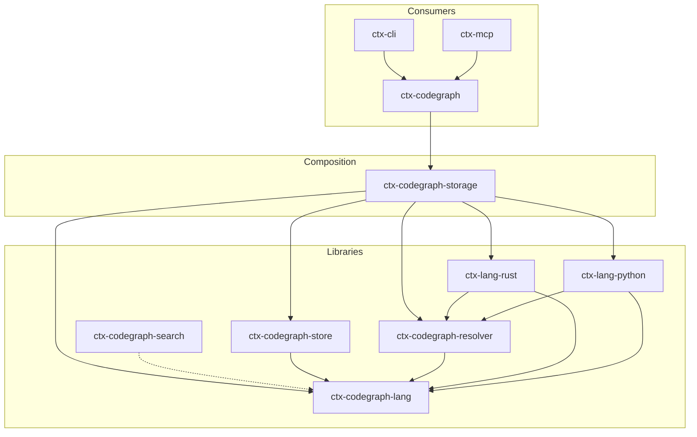

# ctx 🌐

> **Fast, open-source project context generator, semantic code explorer, and Model Context Protocol (MCP) server for LLMs and AI Agents.**

`ctx` is a modern, high-performance command-line utility written in Rust. It helps developers and AI agents bridge the gap between large, complex codebases and Large Language Models (LLMs) like Claude, Gemini, and ChatGPT. By combining fast filesystem traversal, an interactive Terminal UI (TUI), and an experimental semantic code graph with hybrid retrieval (lexical BM25 + dense embeddings), `ctx` generates compact, token-efficient codebase contexts.

---

## 📖 Table of Contents

- [Features](#-features)
- [How to Use](#-how-to-use)
  - [For Humans (CLI & Interactive TUI)](#1-for-humans-cli--interactive-tui)
  - [For AI Agents & LLM Clients (MCP Server)](#2-for-ai-agents--llm-clients-mcp-server)
- [Under the Hood: The Full Indexing Pipeline](#-under-the-hood-the-full-indexing-pipeline)
- [Technology Stack](#-technology-stack)
- [Crate Architecture](#-crate-architecture)
- [Configuration (`.ctxconfig`)](#-configuration-ctxconfig)
- [Contributing Guidelines](#-contributing-guidelines)
- [License](#-license)

---

## ✨ Features

- 📁 **Smart Context Gathering**: Compile your codebase structure and contents into a single structured artifact format (Markdown, XML, or Plain Text) optimized for LLMs.
- 🔍 **Interactive Terminal UI**: Navigate, search, preview, and select files visually using a keyboard-driven TUI to customize context compilation on-the-fly.
- 🧠 **CodeGraph (Semantic Indexing)**: Build a local SQLite semantic index of Rust and Python codebases using multi-language Tree-Sitter AST parsing.
- 📡 **LSP Integration**: Enrich call target resolution using active language servers (such as `rust-analyzer` or `pyright-langserver`) to map exact references.
- 🏎️ **Hybrid Search**: Combine BM25 lexical search (Tantivy) and dense vector embeddings (Snowflake Arctic ONNX models via `ort` ONNX Runtime) with Reciprocal Rank Fusion (RRF).
- 🤖 **Model Context Protocol (MCP) Server**: A JSON-RPC stdio MCP server for direct integration with Cursor, Claude Desktop, Gemini, Claude Code, and other agentic environments.
- 📊 **Token-Budget Packing (`affect`)**: Rank and pack semantic neighborhoods or slices within a specific LLM token budget to prevent context window exhaustion.

---

## 🛠️ How to Use

`ctx` is designed with a dual-audience workflow in mind: optimized for manual human developer exploration, and structured for automated tool-calling by AI agents.

### 1. For Humans: CLI & Interactive TUI

#### Installation
```bash
# Clone the repository
git clone https://github.com/shizmag/ctx-rust.git
cd ctx-rust

# Install the CLI binary locally
cargo install --path crates/ctx-cli
```
*Alternatively, compile in release mode:*
```bash
cargo build --release
# Executable will be available at target/release/ctx
```

#### Quick Start Commands
- **Show Directory Tree**:
  ```bash
  ctx
  ```
- **Generate Full Project Context (Markdown)**:
  ```bash
  ctx -C
  ```
- **Save Context to File**:
  ```bash
  ctx -C -o context.md
  ```
- **Copy Context directly to System Clipboard**:
  ```bash
  ctx -C --clipboard
  ```
- **Launch Interactive TUI Mode**:
  ```bash
  ctx --interactive  # or ctx -i
  ```
  *TUI Hotkeys: `Space` to select/deselect files, `c` to clear configuration/selections, `h`/`l` or arrow keys to navigate and adjust settings, and `Enter` to copy the selected file context.*

- **Build Semantic CodeGraph**:
  ```bash
  # Fast Tree-Sitter AST build only
  ctx graph build
  
  # Full Build: Tree-Sitter + LSP definition lookup + lexical index + dense embeddings
  ctx graph build --all
  ```

---

### 2. For AI Agents & LLM Clients: MCP Server

`ctx` embeds a standard Model Context Protocol (MCP) server over standard I/O (`stdio`). This allows AI agents to dynamically fetch workspace tree structures, read files, query symbols, traverse call graphs, or perform hybrid searches on your codebase.

#### Configuring MCP Clients

Add the following configuration block to your client. Replace `/path/to/ctx` with the absolute path to your compiled `ctx` binary (or just `"ctx"` if the binary is on your `PATH`).

##### Cursor Configuration (`.cursor/mcp.json`)
```json
{
  "mcpServers": {
    "ctx": {
      "command": "/path/to/ctx",
      "args": ["mcp"]
    }
  }
}
```

##### Claude Desktop Configuration
On macOS, add this to `~/Library/Application Support/Claude/claude_desktop_config.json`:
```json
{
  "mcpServers": {
    "ctx": {
      "command": "/path/to/ctx",
      "args": ["mcp"]
    }
  }
}
```

#### Exposed MCP Tools

The MCP server exposes five primary tools:

1. **`retrieve_context`** (Primary LLM retrieval tool):
   - **Arguments**:
     - `query` (string, required): A symbol name, path, or free-text query.
     - `strategy` (enum, optional): `hybrid` | `graph` | `lexical` | `dense`. Defaults to `hybrid` (falls back to `graph` if embeddings are unconfigured).
     - `graph_mode` (enum, optional): `neighborhood` | `callers` | `callees` | `dependencies` | `dependents` | `impact`.
     - `depth` (int or `"auto"`, optional): Traversal depth.
     - `token_budget` (int, optional): Token packing budget (default: `12000`).
     - `format` (enum, optional): `yaml` | `json` | `text`. Defaults to `yaml`.
2. **`list_symbols`**:
   - **Arguments**: `query` (optional filter), `limit` (default: `50`).
3. **`read_file`**:
   - **Arguments**: `path` (required absolute or relative workspace path), `start_line` / `end_line` (optional).
4. **`rebuild_index`**:
   - **Arguments**: `with_all` (boolean), `use_lsp` (boolean), `with_emb` (boolean), `with_lex` (boolean).
5. **`get_project_context`**:
   - **Arguments**: `mode` (smart, code, docs, llm, all), `format` (markdown, xml, plain), `include_stats` (boolean).

#### Exposed Resources & Prompts
- **Resources**:
  - `ctx://index/status` – View indexing statistics, file counts, and build metadata.
  - `ctx://project/tree` – Retrieve a brief directory tree layout of the current workspace.
- **Prompts**:
  - `explore-symbol` – Guided workflow for finding and analyzing code references.

---

## ⚙️ Under the Hood: The Full Indexing Pipeline

`ctx` generates semantic indexes and call graphs incrementally. Here is the step-by-step pipeline:

```
[ Filesystem ]
      │
      ▼
1. Scan & Filter ────────► Respects .gitignore, skips caches (node_modules, target, etc.)
      │
      ▼
2. AST TS Parsing ───────► Treesitter extracts Rust/Python symbols, calls, scopes
      │
      ▼
3. LSP Resolution ───────► Queries active LSPs (rust-analyzer/pyright) for exact defs
      │
      ▼
4. Chunking ─────────────► Breaks source code into hierarchical AST-aware chunks
      │
      ├───────────────────────────────┐
      ▼                               ▼
5. BM25 Lexical Indexing       6. Dense Vector Embeddings
   (Tantivy index builder)        (Snowflake ONNX runtime via `ort`)
      │                               │
      ▼                               ▼
 [ Tantivy Store ]              [ dense.sqlite ]
      │                               │
      └───────────────┬───────────────┘
                      ▼
             7. RRF Query Fusion (Lexical + Dense Ranker)
                      │
                      ▼
             8. Token-Budget Packing (ContextPack outputs Markdown/YAML)
```

1. **Scan & Filter**: The traversal engine scans directories, respects `.gitignore` rules, and applies smart filters to ignore large build directories (`target/`, `node_modules/`, `.git/`, virtual environments).
2. **AST Parsing**: Supported files (Rust and Python) are parsed locally with Tree-Sitter. This generates AST-level definitions (structs, classes, functions, traits) and records scopes and unresolved symbol occurrences.
3. **LSP Definition Resolution (Optional)**: If `--with-lsp` (or `--all`) is passed, `ctx` communicates with language servers (like `rust-analyzer` or `pyright-langserver`) to resolve ambiguous references to their precise definition source. This resolves calls to `LspExact` edges.
4. **Semantic Chunking**: The graph compiler slices files into logical chunks based on symbol bounds and AST definitions. Parent-child relationships are mapped to write `Contains` edges.
5. **Lexical Indexing**: Chunk texts are compiled into a local Tantivy full-text index using BM25 token weighting.
6. **Dense Vector Embeddings (Optional)**: If `embedding_model` is configured, chunk contents are run through a local ONNX embedding model (default: `snowflake-arctic-embed-m-v2.0` with 768 dimensions) using the `ort` crate. The resulting vector coordinates are written to a SQLite table (`dense.sqlite`).
7. **Query-Time Retrieval (RRF)**: At query time, dense and lexical candidate lists are merged using Reciprocal Rank Fusion (RRF):
   $$\text{score} = \sum_{m \in M} \frac{1}{k + \text{rank}_m}$$
8. **Token-Budget Packing (`affect`)**: Candidates are expanded into their semantic graph neighborhoods (callers, callees, dependencies). Slices are ranked and loaded into a `ContextPack`, which fills the specified LLM token budget (e.g., 12k tokens) by discarding lower-ranking chunks and returning the rest in a structured layout (YAML/JSON/Markdown).

---

## 💻 Technology Stack

`ctx` is engineered in Rust for low memory overhead and high speed:
- **Rust**: Language Core.
- **Clap**: CLI argument parsing.
- **Ratatui & Crossterm**: Terminal User Interface renderer.
- **Tree-Sitter**: Parser generation and syntax node queries.
- **Tantivy**: Local, high-performance search index engine (BM25).
- **SQLite & Rusqlite**: Relational storage for codegraph structure and vector embeddings metadata.
- **ort (ONNX Runtime)**: Local inference for Snowflake-Arctic embeddings and Jina rerankers.
- **LSP JSON-RPC**: Subprocess transport to language servers.

---

## 🏗️ Crate Architecture

To maintain high compile-time speeds and clean structural boundaries, the codebase is modularized:



### Key Workspace Members
- **`crates/ctx-cli`**: CLI entry point and settings commands.
- **`crates/ctx-tui`**: Terminal browser UI and user configuration view.
- **`crates/ctx-mcp`**: stdio Model Context Protocol layer.
- **`crates/ctx-core`**: Filesystem crawling, statistics compilation, and file filters.
- **`crates/ctx-codegraph`**: Context budgeting, graph slicing, and packing engine.
- **`crates/ctx-codegraph-store`**: SQLite database schemas and persistence operations.
- **`crates/ctx-codegraph-resolver`**: LSP transportation client.
- **`crates/ctx-lang-rust` / `ctx-lang-python`**: Language-specific Tree-Sitter parsers.
- **`crates/ctx-codegraph-search`**: Search coordinator (BM25 & Vector).

---

## 🔧 Configuration (`.ctxconfig`)

Configuration files are placed in the project root as `.ctxconfig` or `.ctx.toml`.

```ini
# --- Scan Settings ---
mode = "smart"
max_depth = 6
max_file_size = 524288
exclude = [
    "target",
    "node_modules",
    "*.log"
]

# --- Model & Hybrid Search Settings ---
# Enable hybrid search indexing and query-time embeddings:
embedding_model = /path/to/snowflake-arctic-embed-m-v2.0/model.onnx

# Optional settings
reranker_model = /path/to/jina-reranker-v2-base-multilingual/model.onnx
tokenizer_dir = /path/to/tokenizer_files
rrf_k = 60
bm25_top_k = 50
dense_top_k = 50
enable_rerank = false
default_retrieval_strategy = hybrid
```

---

## 🤝 Contributing Guidelines

We welcome contributions to `ctx`! Whether you are fixing bugs, writing tests, improving documentation, or adding support for new languages, your help is highly appreciated.

### Rules of Engagement

1. **Communication**: All discussions, issues, PR descriptions, and comments must be in **English**.
2. **Regression Safety**: Do not introduce breaking API changes without an open issue discussion. Keep all changes focused and minimal.
3. **Quality Bar**:
   - Ensure your code adheres to standard Rust formatting (`cargo fmt`).
   - Run Clippy and resolve any warnings before submitting (`cargo clippy`).
   - Every feature or bug fix must be covered by unit/integration tests (`cargo test`).

### Code Verification Pipeline

Before committing your changes or opening a pull request, run the verification suite:

```bash
# Format check
cargo fmt --all -- --check

# Lints and checks
cargo clippy --all-targets --all-features -- -D warnings

# Execute test suite
cargo test --all-targets --all-features
```

### Adding a New Language Backend

To add parsing support for a new language (e.g., Go or TypeScript):
1. Create a new crate: `crates/ctx-lang-<lang>`.
2. Implement the parser using Tree-Sitter and wire it with a `LanguageBackend` trait interface.
3. If an LSP server is available, configure `LspDefinitionResolver` options in `crates/ctx-codegraph-resolver`.
4. Register the new language backend in `crates/ctx-codegraph-storage/src/registry.rs`.
5. Add parser tests under `crates/ctx-lang-<lang>/tests/` and verify the compilation.

---

## 📄 License

`ctx` is open-source software licensed under the [MIT License](LICENSE).