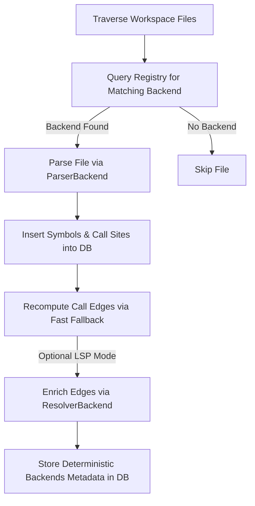

# CodeGraph Backend Architecture

This document describes the design, boundary traits, and registry system used to make `ctx-codegraph` language-agnostic.

---

## 🎨 Why a Backend-Based Architecture?

Originally, `ctx-codegraph` was designed as a Rust-only tool. Direct tree-sitter Rust calls, workspace root detection looking specifically for `Cargo.toml`, and `rust-analyzer` JSON-RPC startup logic were deeply coupled inside the core indexing and database storage layer.

To support multiple languages (e.g. Python, TypeScript, Go) without rewriting the core orchestration, database storage, queries, and service APIs, we introduced a clean **Language Backend Abstraction Boundary**. 

---

## 🏗️ Core vs Language Backend Boundary

The project is split into:
1. **Generic Core**: Manages the workspace file traversal, change detection (mtime/size/hash), database schema initialization, SQL CRUD operations, caller/callee querying, and semantic slicing. It knows *nothing* about tree-sitter node definitions, file extensions, or language-specific LSP commands.
2. **Language Backends**: Provide language-specific file matching, project layout markers, AST parsing logic, and optional LSP-based resolver endpoints.

### Core Traits & Types

All backends implement the traits defined in [src/backend/traits.rs](file:///Users/vladimirkasterin/python/ctx-rust/crates/ctx-codegraph/src/backend/traits.rs):

```rust
pub trait LanguageBackend: Send + Sync {
    fn id(&self) -> BackendId;
    fn language(&self) -> LanguageId;
    fn display_name(&self) -> &'static str;

    fn matches_path(&self, path: &Path) -> bool;
    fn parser(&self) -> &dyn ParserBackend;
    fn resolver(&self) -> Option<&dyn ResolverBackend>;

    fn workspace_markers(&self) -> &[WorkspaceMarker];
    fn metadata(&self, config: &BuildIndexOptions) -> BackendMetadata;
    fn config_fingerprint(&self, config: &BuildIndexOptions) -> String;
}

pub trait ParserBackend: Send + Sync {
    fn parser_id(&self) -> ParserId;
    fn parser_version(&self) -> String;
    fn parse_file(&self, input: ParseInput<'_>) -> Result<ParsedFile, CodeGraphError>;
}

pub trait ResolverBackend: Send + Sync {
    fn resolver_id(&self) -> ResolverId;
    fn resolver_version(&self) -> String;
    fn resolve(&self, input: ResolveInput<'_>) -> Result<ResolveOutput, CodeGraphError>;
}
```

---

## 🔄 Indexing Lifecycle

The generic index orchestrator follows this lifecycle:



1. **Discovery**: Traverses the files in the workspace (skipping hidden and ignored directories).
2. **Matching**: Queries the `BackendRegistry` via `find_by_path` to find a matching backend.
3. **Parsing**: Invokes `ParserBackend::parse_file` to extract generic `Symbol` and `CallSite` structs.
4. **Fast Resolution**: Resolves references using a simple name-only heuristic first (fast, local fallback).
5. **LSP Enrichment**: If the global `use_lsp` config is enabled, retrieves the `ResolverBackend` for the call site's file and resolves it to its exact definition.
6. **Metadata Persistence**: Serializes the active backends' versions and config hashes deterministically into the database for future compatibility validation.

---

## 📂 Where Language-Specific Code Lives

* **Rust Backend**: Exclusively located under [src/languages/rust/](file:///Users/vladimirkasterin/python/ctx-rust/crates/ctx-codegraph/src/languages/rust/).
  * `parser.rs`: Contains the tree-sitter AST queries.
  * `resolver.rs`: Implements the `rust-analyzer` JSON-RPC initialization and definition requests.
  * `mod.rs`: Ties the parser and resolver into the `RustBackend`.
* **Mock Backend**: Located under [src/languages/mock.rs](file:///Users/vladimirkasterin/python/ctx-rust/crates/ctx-codegraph/src/languages/mock.rs) and gated under `#[cfg(test)]` to verify pipeline modularity.

---

## 🚫 What Should Never Leak to Generic Core

To maintain a clean separation of concerns, the generic core (`index.rs`, `storage.rs`, `service.rs`, `slice.rs`, `lib.rs`) must **never**:
* Import anything from `crates/ctx-codegraph/src/languages/rust/*`.
* Contain hardcoded string literals like `"Rust"`, `"rust"`, `.rs`, or `Cargo.toml`.
* Reference LSP client implementations directly (e.g. `GenericLspClient` should only be instantiated by specific `ResolverBackend` implementations).
